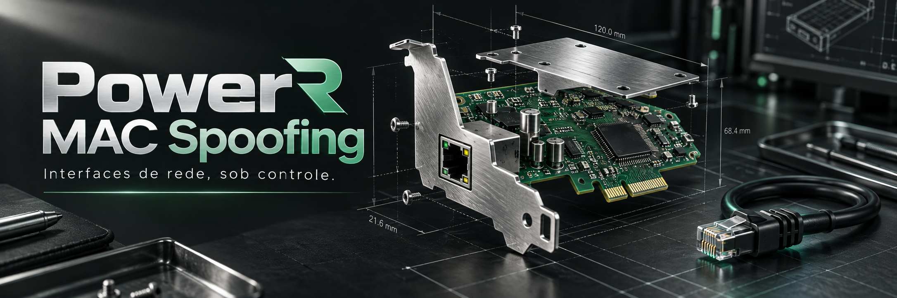

<div align="center">



# PowerR MAC Spoofing

### Interfaces de rede, sob controle.

Utilitário gráfico PowerShell para inspecionar interfaces e alterar ou restaurar endereços MAC em um ambiente Windows controlado. O código também contém integração de captura com TShark.

[](Change-MAC-Address.ps1) [](Change-MAC-Address.ps1)

[Escopo e requisitos](#escopo-e-requisitos) · [Começar pela revisão](#começar-pela-revisão) · [Organização](#organização) · [Limites e validação](#limites-e-validação)

</div>

> O banner é uma ilustração conceitual de marca criada com IA; não é uma captura da aplicação nem comprovação de um resultado real.

| Inspecione | Configure | Restaure |
| :--- | :--- | :--- |
| Identifique o adaptador em laboratório. | Revise a configuração e seus efeitos de conectividade. | Confira o retorno ao endereço e estado originais. |

## Escopo e requisitos

Requer Windows, Windows PowerShell, Windows Forms e privilégios administrativos. A integração de captura usa o caminho do Wireshark/TShark definido no código; a enumeração de interfaces também depende desse executável.

## Começar pela revisão

```powershell
git clone https://github.com/eep0x10/powerr-macspoofing.git
cd powerr-macspoofing
Get-Content .\Change-MAC-Address.ps1
```

Revise [Change-MAC-Address.ps1](Change-MAC-Address.ps1), prepare uma máquina de laboratório e registre a configuração original antes de executar. O script solicita elevação e pode interromper a conectividade ao alterar a interface. Não execute em uma sessão remota da qual dependa para recuperação.

## Organização

| Parte | Papel |
| --- | --- |
| Inicialização | Elevação de privilégios e carregamento de Windows Forms. |
| Interface | Seleção de adaptador, endereço, atualização e restauração. |
| Integração TShark | Enumeração e captura na interface selecionada. |

## Limites e validação

Compatibilidade depende do driver e da permissão de alteração do adaptador. Não há suíte automatizada nem rotina de instalação. Em laboratório autorizado, confirme a interface selecionada, a restauração do endereço original e a conectividade após encerrar. A ferramenta não garante anonimato nem autorização de acesso à rede.
